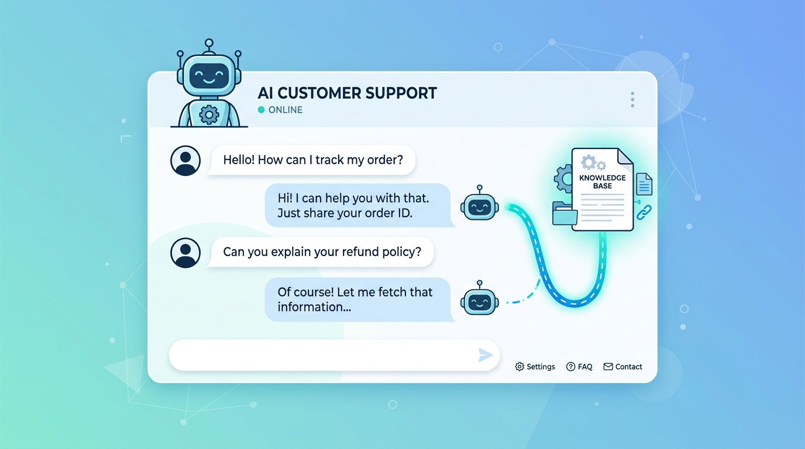
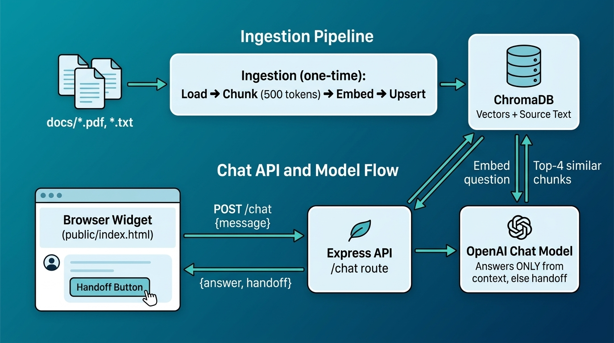

# AI Customer Support Chatbot (RAG)



A Retrieval-Augmented Generation (RAG) customer support chatbot built with
**OpenAI**, **ChromaDB**, and **Express**. It ingests your support documents
(PDF and text), embeds them into a local vector store, and answers user
questions **grounded strictly in that knowledge base**. When an answer isn't
covered by your documents, it cleanly hands off to human support instead of
guessing.

A small, self-contained web chat widget is included and served by the same
Express app.

## What it does

- 📄 Ingests `.pdf` and `.txt` files from the `docs/` folder.
- ✂️ Splits them into ~500-token chunks (50-token overlap) using `js-tiktoken`.
- 🧠 Embeds chunks with OpenAI `text-embedding-3-small` and stores them in a
  local **ChromaDB** collection (idempotent — re-running doesn't duplicate data).
- 💬 Answers questions over `POST /chat` using only the retrieved context.
- 🙋 Flags `handoff: true` and shows a "Contact human support" button when the
  answer isn't in the docs.

## Architecture (RAG flow)



**Two phases:**

1. **Ingestion** (`src/ingestDocs.js`) — runs once (or whenever docs change):
   load documents → token-chunk → embed → upsert into ChromaDB. Each chunk gets a
   deterministic content-hash ID so re-running is safe and won't duplicate data.
2. **Query** (`src/services/chat.js`) — per request: embed the question →
   retrieve the top-4 nearest chunks → ask the chat model to answer **only** from
   that context, returning `{ answer, handoff }`.

## Project structure

```
support-chatbot/
├── docs/                   # Put your .pdf / .txt source documents here
├── public/
│   └── index.html          # Self-contained chat widget (vanilla JS)
├── src/
│   ├── config/
│   │   └── index.js        # Loads .env, validates secrets, model defaults
│   ├── lib/
│   │   ├── openai.js       # OpenAI client + embed() / chat helpers
│   │   ├── chroma.js       # ChromaDB client + collection
│   │   ├── tokenChunker.js # Token-based chunking (js-tiktoken)
│   │   ├── chunker.js      # (legacy char-based chunker)
│   │   └── loader.js       # PDF/text loaders
│   ├── services/
│   │   └── chat.js         # answerQuestion(): retrieve + generate + handoff
│   ├── routes/
│   │   └── chat.js         # POST /chat handler
│   ├── ingestDocs.js       # Ingestion entry point (npm run ingest)
│   └── server.js           # Express app: API + static frontend
├── .env.example
├── .gitignore
└── package.json
```

## Requirements

- **Node.js >= 18**
- An **OpenAI API key**
- A running **ChromaDB** instance (local, via Docker)

## Setup

```bash
# 1. Install dependencies
npm install

# 2. Configure environment (copy the template, then add your key)
cp .env.example .env
#    → edit .env and set OPENAI_API_KEY

# 3. Start ChromaDB locally (Docker)
docker run -p 8000:8000 chromadb/chroma

# 4. Add your .pdf / .txt files to ./docs, then ingest them
npm run ingest

# 5. Start the server
npm start
```

Then open **http://localhost:3000** to use the chat widget.

> **Note:** answers are grounded strictly in your ingested documents. If `docs/`
> is empty (or ChromaDB has no data), every reply will be a human handoff.

## Configuration

All configuration is read from environment variables (see `.env.example`). No
secrets are hardcoded.

| Variable         | Required | Default                 | Description                     |
| ---------------- | -------- | ----------------------- | ------------------------------- |
| `OPENAI_API_KEY` | ✅ yes   | —                       | OpenAI API key for embeddings + chat |
| `PORT`           | no       | `3000`                  | HTTP port for the Express server |
| `CHROMA_URL`     | no       | `http://localhost:8000` | ChromaDB server URL             |

Model and chunking defaults (`text-embedding-3-small`, `gpt-4o-mini`, chunk
sizes, `topK`) live in `src/config/index.js`.

## API

### `POST /chat`

Request:

```json
{ "message": "How do I reset my password?" }
```

Response:

```json
{
  "answer": "Go to Settings → Security and click \"Reset password\".",
  "handoff": false
}
```

When the answer isn't found in the knowledge base:

```json
{
  "answer": "I'm not able to answer that from our support documentation. I'll hand this off to a human support agent who can help you further.",
  "handoff": true
}
```

### `GET /health`

Returns `{ "status": "ok" }`.

## Scripts

| Command           | Description                                      |
| ----------------- | ------------------------------------------------ |
| `npm start`       | Start the Express server (API + chat widget)     |
| `npm run dev`     | Start with `--watch` for auto-reload             |
| `npm run ingest`  | Ingest `docs/` into ChromaDB                      |

## License

MIT
